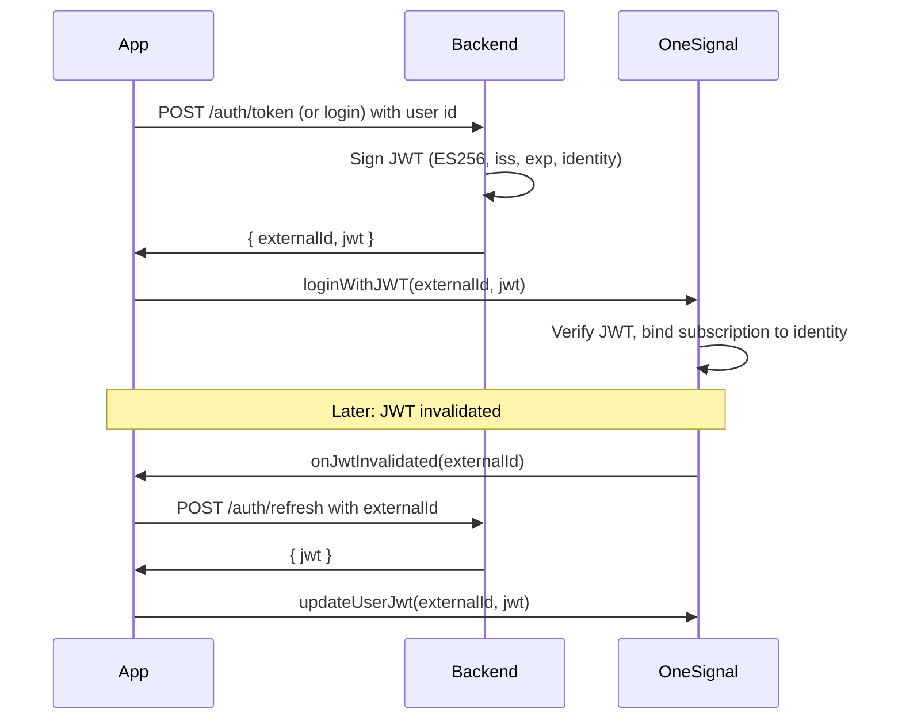

# OneSignal Identity Verification Implementation

## Progress log

| Date | What was done |
|------|----------------|
| 2025-02-26 | **Step 2 done**: Backend JWT generation added. Created `backend/` with `package.json` (express, jsonwebtoken, dotenv, cors), `index.js` (POST /auth/token, POST /auth/login, POST /auth/refresh, GET /health; ES256 JWT signing with comments), `.env.example`. Updated root `.gitignore` with `backend/.env` and `backend/node_modules`. |
| 2025-02-26 | OneSignal Flutter SDK updated from `^5.1.2` to `^5.4.1` in `pubspec.yaml`. |
| 2025-02-26 | Plan saved as `identity-verification-plan.md` in project root. Progress log added. |
| 2025-02-26 | **E-Commerce home (Figma replica):** Added separate page [lib/screens/ecommerce_home_page.dart](lib/screens/ecommerce_home_page.dart), linked from OneSignal page in [lib/main.dart](lib/main.dart). Replicated unlogged home from Figma: header "Mega Mall", search "Search Product Name", promo banner (Gatis Ongkir / Selama PPKM! / Periode Mei - Agustus 2021), Categories with See All (Foods, Gift, Fashion, Gadget, Comp), Featured Product with See All, Best Sellers with See All. Product cards use real images (Unsplash); Best Seller cards include rating (e.g. 4.6), review count (e.g. 86 Reviews), and options (three-dots). Bottom nav: HOME, WISHLIST, ORDER, LOGIN (outline icons, selected = blue with circular highlight). Figma design reference: see **Figma design reference** below. |

**Next:** Step 3 – Add login UI in the app, call backend for JWT, then `OneSignal.loginWithJWT(externalId, jwt)`; add logout.

---

## Figma design reference

- **Link:** [E-Commerce - Mobile Apps (Community)](https://www.figma.com/design/Rln7pVYbArGhZkyycrNnSK/E-Commerce---Mobile-Apps--Community-?node-id=0-1)
- **File key:** `Rln7pVYbArGhZkyycrNnSK`
- **Root node (full canvas):** `node-id=0-1` (use `0:1` in API)
- **What was built from it:** E-Commerce home (unlogged state) – header, search bar, promo banner, Categories (circular icons), Featured Product (horizontal scroll, TMA-2 HD Wireless, Rp. 1.500.000 in red), Best Sellers (horizontal scroll, product cards with rating/reviews and options icon), bottom nav (HOME, WISHLIST, ORDER, LOGIN). Use this link to fetch more frames (e.g. specific screens) for design-to-code via Figma MCP.

---

## Current state

- **App**: [lib/main.dart](lib/main.dart) uses OneSignal with anonymous device user (no `login` or external ID). Displays OneSignal ID, push subscription ID, and token.
- **Backend**: **Done.** `backend/` has Node + Express + JWT (ES256). Endpoints: POST /auth/token, POST /auth/login, POST /auth/refresh, GET /health. Run with `cd backend && npm install && npm start`. Configure `backend/.env` from `.env.example` (App ID + Identity Verification private key PEM).
- **Flutter SDK**: `onesignal_flutter: ^5.4.1`. The SDK exposes `OneSignal.login(externalId)` and `OneSignal.loginWithJWT(externalId, jwt)`. Check [OneSignal Identity Verification docs](https://documentation.onesignal.com/docs/en/identity-verification) and [Flutter SDK](https://github.com/OneSignal/OneSignal-Flutter-SDK) for JWT invalidation listener and iOS support.

---

## 1. Identity Verification (OneSignal Dashboard) – done

Identity Verification is **already enabled** for this app. You have:

- Generated keys in **Settings > Keys & IDs > Identity Verification** (or will use existing keys).
- The **private key (PEM)** must be stored securely and used only on the backend (e.g. in `backend/.env`). Never commit it or expose it in the app.
- **Token Identity Verification** toggle is on in **Settings > Keys & IDs**.

If you need to regenerate keys or re-check the toggle, go to **Settings > Keys & IDs > Identity Verification** in the OneSignal Dashboard.

---

## 2. Backend: JWT generation (in this project, run locally)

A **mini backend** lives **inside this project** in a `backend/` subfolder and runs **on your computer** for testing. Same code can be deployed to a cloud service later.

**Location and layout**

- Add a `backend/` folder at the project root (sibling to `lib/`, `android/`, etc.):

```text
2025-flutter/
  lib/                 # Flutter app (existing)
  android/
  ios/
  backend/             # Mini backend – new
    package.json
    .env                # Secrets – do not commit (see below)
    index.js            # Express + JWT endpoint(s)
  pubspec.yaml
  .gitignore            # Add backend/.env and backend/node_modules
  ...
```

- **Run locally**: From the project root, `cd backend && node index.js` (or `npm start`). Server listens on a port (e.g. 3000). The Flutter app will call this server using:
  - **Android emulator**: `http://10.0.2.2:3000`
  - **iOS simulator**: `http://localhost:3000`
  - **Real device (same Wi-Fi)**: `http://<your-computer-IP>:3000` (e.g. `http://192.168.1.5:3000`)

**What the backend does**

You need a small service that:

- **Authenticates** the user (for demo, a simple "login" that accepts an identifier and returns a JWT is enough).
- **Signs a JWT** with ES256 using the **private key** from the OneSignal Dashboard.
- **Payload** must include:
  - `iss`: Your OneSignal App ID
  - `exp`: Expiration (e.g. 1 hour)
  - `identity`: e.g. `{ "external_id": "<your-user-id>" }`
- Optionally: **subscriptions** in the JWT when adding email/SMS later (see [Identity Verification – JWT payload](https://documentation.onesignal.com/docs/en/identity-verification#jwt-payload)).

**Stack**: Node.js + Express + a JWT library (e.g. [jsonwebtoken](https://www.npmjs.com/package/jsonwebtoken)) with algorithm `ES256`. Store the private key (PEM) in `backend/.env` as e.g. `ONESIGNAL_IDENTITY_VERIFICATION_PRIVATE_KEY` and `ONESIGNAL_APP_ID`; never commit `.env`.

**Endpoints**

- **POST /auth/token** (or **/auth/login**): Accept a simple body (e.g. `{ "userId": "optional-demo-id" }`). If no real auth yet, treat this as "demo login" and use a generated or fixed external ID. Generate JWT with `iss`, `exp`, `identity.external_id`, sign with private key, return `{ "externalId": "...", "jwt": "..." }`.
- **POST /auth/refresh** (optional): Same JWT generation; app calls when OneSignal invalidates the token (pass `externalId` in body).

**Gitignore**

- Add to the project root `.gitignore`: `backend/.env` and `backend/node_modules` so the private key and dependencies are never committed.

---

## 3. App: Login flow and OneSignal login with JWT

**3.1 Introduce "user" and external ID**

- Add a minimal login step (e.g. a "Login" button or a simple form that submits a user id). For demo, the app can generate a UUID or use a placeholder; later you can replace this with real auth.
- After "login", the app should have a stable **external ID** (e.g. `String externalId`) to use for OneSignal.

**3.2 Get JWT from your backend**

- From the Flutter app, call your backend (e.g. `POST http://10.0.2.2:3000/auth/token` for Android emulator when running backend locally, or `/auth/login`) with the chosen user identifier.
- Backend returns `{ "externalId": "...", "jwt": "..." }`.
- Store `externalId` (and optionally the JWT) in memory or secure storage for the session.

**3.3 Call OneSignal login with JWT**

- After receiving `externalId` and `jwt`, call:
  - `OneSignal.loginWithJWT(externalId, jwt)` (Flutter SDK 5.x).
- If Identity Verification is not yet enabled, you can still use `OneSignal.login(externalId)` for testing; once the feature is on, switch to `loginWithJWT` so subscriptions are verified.

**3.4 JWT invalidation (when supported)**

- OneSignal may invalidate the JWT (e.g. expiry). Native docs use `addUserJwtInvalidatedListener` and `updateUserJwt`. The Flutter SDK 5.3.4 does not expose these in the Dart API; check the [Flutter SDK repo](https://github.com/OneSignal/OneSignal-Flutter-SDK) for a listener and `updateUserJwt`. If available:
  - Register the listener at startup or after login.
  - On invalidation, call your backend refresh endpoint to get a new JWT, then call the SDK's update method (e.g. `updateUserJwt(externalId, newJwt)`).

**3.5 Logout**

- When the user "logs out", call `OneSignal.logout()` so the device returns to an anonymous user. Optionally clear stored `externalId` and JWT.

**Files to touch**

- [lib/main.dart](lib/main.dart): Add a simple login UI (or button), HTTP client to call backend, then `OneSignal.loginWithJWT(externalId, jwt)` after successful login; optionally JWT invalidation listener and logout.
- New file (e.g. `lib/services/onesignal_auth_service.dart` or similar): Encapsulate backend URL, login/refresh API calls, and calling OneSignal login/logout/updateJwt keeps main.dart cleaner.

---

## 4. Flow summary



---

## 5. Order of work

| Step | Action |
| ---- | ----------------------------------------------------------------------------------------------------------------------------------------------------------------------------------------------------------------- |
| 1    | **Done**: Identity Verification enabled; keys and toggle set in Dashboard. |
| 2    | **Done**: `backend/` created with package.json, index.js, .env.example; .gitignore updated; POST /auth/token, /auth/login, /auth/refresh, GET /health. Run: `cd backend && npm install && npm start`; copy `.env.example` to `.env` and set App ID + private key PEM. |
| 3    | In the app: add simple login UI, call backend for JWT (use `http://10.0.2.2:3000` for Android emulator), then call `OneSignal.loginWithJWT(externalId, jwt)`; add logout with `OneSignal.logout()`. |
| 4    | If Flutter SDK exposes JWT invalidation: add listener and refresh endpoint call, then `updateUserJwt`. |
| 5    | Test: run backend locally, run app, login in app, confirm in OneSignal Dashboard that the user/subscription is tied to the external ID; test logout. |

---

## 6. Caveats

- **Flutter SDK**: `loginWithJWT` in 5.3.4 is deprecated and only invoked on Android in the Dart code. Verify current [Flutter SDK](https://github.com/OneSignal/OneSignal-Flutter-SDK) and [Identity Verification](https://documentation.onesignal.com/docs/en/identity-verification) docs for the recommended Flutter API and iOS support.
- **Security**: Private key must stay on the backend; the app only ever receives JWTs. Use HTTPS for all backend calls.
- **No backend yet**: The plan assumes you add a small backend (e.g. Node + Express or a single Cloud Function) for JWT signing; without it, Identity Verification cannot be used.
